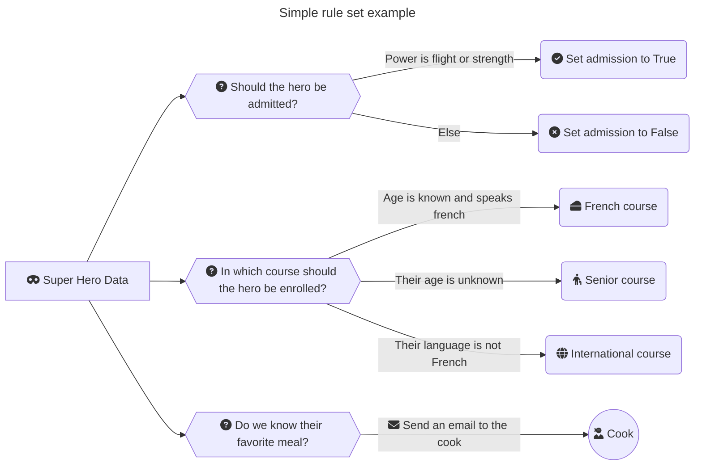

## Intro 

As we already mentioned: ***Arta** is a simple python rules engine*.

But what do we mean by *rules engine*?

* **rule** : a set of different conditions that can be `True` or `False` (i.e., we say *verified* or *not verified*) triggering an action (i.e., any python callable object).
* **engine** : some code used for combining and evaluating different rules on some input data.

## The Superhero School :school: :superhero:

Imagine the following use case: 

*Your are managing a superhero school and you want to use some school rules in your python app.*

The rules (intentionally simple) are:




### Rules

You can define above rules for **Arta** in one simple *YAML* file :

```yaml
---
rules:
  default_rule_set:
    admission:
      ADMITTED:
        simple_condition: input.power=="strength" or input.power=="fly"
        action: set_admission
        action_parameters:
          value: true  
      NOT_ADMITTED:
        simple_condition: null
        action: set_admission
        action_parameters:
          value: false
    course:
      FRENCH:
        simple_condition: input.language=="french" and input.age!=None
        action: set_course
        action_parameters:
          course_id: french
      SENIOR:
        simple_condition: input.age==None
        action: set_course
        action_parameters:
          course_id: senior
      INTERNATIONAL:
        simple_condition: input.language!="french"
        action: set_course
        action_parameters:
          course_id: international
    favorite_meal:
      EMAIL:
        simple_condition: input.favorite_meal!=None
        action: send_email
        action_parameters:
          mail_to: cook@super-heroes.test
          mail_content: "Thanks for preparing once a month the following dish:"
          meal: input.favorite_meal
    


actions_source_modules:
  - my_folder.actions
```

!!! info "Simple Conditions"

    This configuration uses what we called *simple conditions*, you can find out more [here](how_to.md#simple-condition).

### Actions

An **action** is triggered when the conditions are verified (i.e., `True`).

**Actions** are defined by the following *keys* in the previous YAML file:

```yaml
        action: set_admission  # (1)
        action_parameters:  # (2)
          value: true  
```

1. Name of the *python callable object* used as an **action function**.
2. The **action function** arguments.

The **action function**'s implementation has to be located in the configured module:

```yaml
actions_source_modules:
  - my_folder.actions
```

And could be for example (intentionally simple) in `actions.py`:

```python
from typing import Any


def set_admission(value: bool, **kwargs: Any) -> dict[str, bool]:
    """Return a dictionary containing the admission result."""
    return {"is_admitted": value}


def set_course(course_id: str, **kwargs: Any) -> dict[str, str]:
    """Return the course id as a dictionary."""
    return {"course_id": course_id}


def send_email(mail_to: str, mail_content: str, meal: str, **kwargs: Any) -> str | None:
    """Send an email."""
    result: str | None = None

    if meal is not None:
        # API call here
        result = "sent"

    return result
```

!!! warning "\*\*kwargs"

    **\*\*kwargs** is mandatory in *action functions*.

### Engine

The *rules engine* is responsible for evaluating the [configured rules](#rules) against some *data* (usually named *"input data"*). 

In our use case, the input data could be a list of applicants:

```python
applicants = [
    {
        "id": 1,
        "name": "Superman",
        "civilian_name": "Clark Kent",
        "age": None,
        "city": "Metropolis",
        "language": "english",
        "power": "fly",
        "favorite_meal": "Spinach",
        "secret_weakness": "Kryptonite",
        "weapons": [],
    },
    {
        "id": 2,
        "name": "Batman",
        "civilian_name": "Bruce Wayne",
        "age": 33,
        "city": "Gotham City",
        "language": "english",
        "power": "strength",
        "favorite_meal": None,
        "secret_weakness": "Feel alone",
        "weapons": ["Hands", "Batarang"],

    },
    {
        "id": 3,
        "name": "Wonder Woman",
        "civilian_name": "Diana Prince",
        "age": 5000,
        "city": "Island of Themyscira",
        "language": "french",
        "power": "strength",
        "favorite_meal": None,
        "secret_weakness": "Lost faith in humanity",
        "weapons": ["Magic lasso", "Bulletproof bracelets", "Sword", "Shield"],
    },
]
```

Now, let's apply the **rules** on a single applicant:

```python
from arta import RulesEngine

eng = RulesEngine(config_path="/to/my/config/dir")  # (1)

result = eng.apply_rules(input_data=applicants[0])

print(result)  # (2)
# {
# "admission": {"is_admitted": True},
# "course": {"course_id": "senior"},
# "favorite_meal": "sent"
# }
```

1. Many possibilites for instanciation, we will explain them later.
2. Print a single result for the first applicant.

In the **rules engine** result, we have 3 outputs: 

* `"admission": {"is_admitted": True},`
* `"course": {"course_id": "senior"},`
* `"favorite_meal": "sent"` 

Each corresponds to one of these [rules](#the-superhero-school).

Here, we can apply the rules to all the **data set** (3 applicants) with a simple dictionary comprehension:

```python
from arta import RulesEngine

results = {applicant["name"]: eng.apply_rules(applicant) for applicant in applicants}

print(results)
# {
#   "Superman": {
#       "admission": {"is_admitted": True}, 
#       "course": {"course_id": "senior"}, 
#       "favorite_meal": "sent"},
#   "Batman": {
#       "admission": {"is_admitted": True},
#       "course": {"course_id": "international"},
#       "favorite_meal": None,
#       },
#   "Wonder Woman": {
#       "admission": {"is_admitted": True},
#       "course": {"course_id": "french"},
#       "favorite_meal": None,
#       }
# }
```

It is the end of this **Arta**'s overview. If you want now to go deeper in how to use **Arta**, click [here](how_to.md).