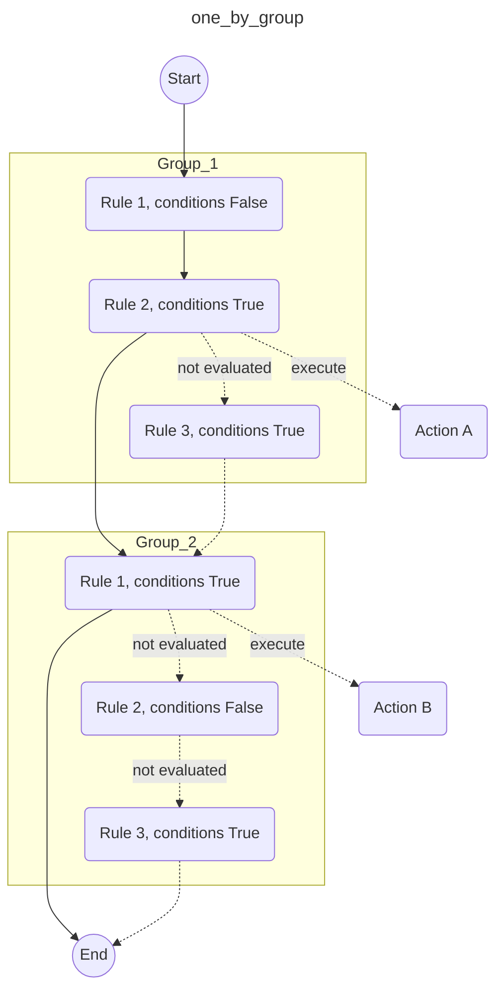
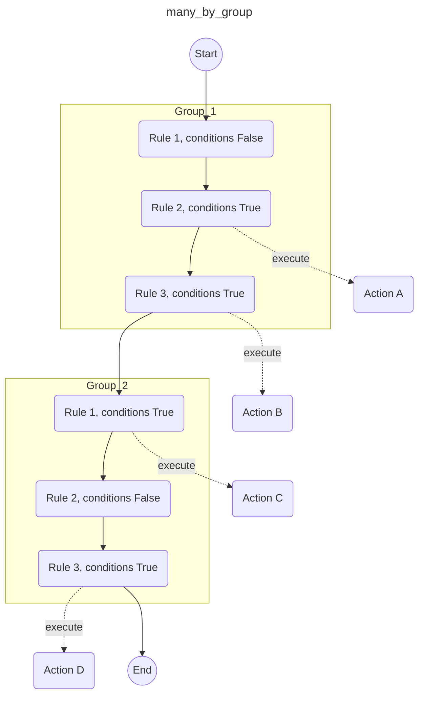

!!! example "Beta feature"

    This new feature (i.e., `rule_activation_mode: many_by_group`) is a **beta feature**, some cases could not work as designed. Please report them using [issues](https://github.com/MAIF/arta/issues).

This feature was designed at MAIF when the idea to use **Arta** as a simple *process execution engine* came about. 

Our goal was to handle different *rules* of data processing inside an ETL pipeline.

It's actually quite simple :zap:

## Illustration

Traditionaly, **Arta** is evaluating rules (like most rules engines) like this:



> **Only one rule is activated (i.e., meaning one action is triggered) by rule group.**

---

But if we need to use **Arta** to execute *simple workflows*, we need a *control flow* like this one:



> **All rules are evaluated.**

> **Therefore, many rules can be activated (i.e., meaning many actions can be triggered) by rule group.**

---

## Setting

You just need to add somewhere in the YAML configuration file of **Arta** the following setting:

### One by group

This *traditional* flow of control is the **default one**:

```yaml
rule_activation_mode: one_by_group
```

!!! note "Default value"

    Because it is the **default value**, it is *useless* to add this line in the configuration.

### Many by group

This is the *flow of control* of a **process execution engine**:

```yaml
rule_activation_mode: many_by_group
```

That's all! You are all set :+1: