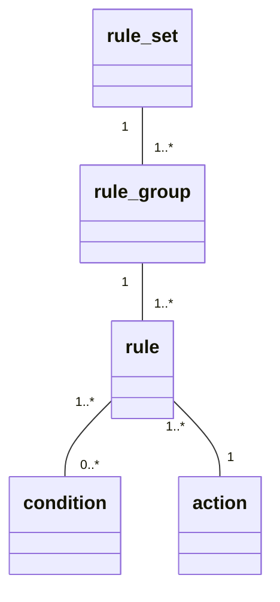

**Rule sets** are a convenient way to separate your business rules into different collections. 

Doing so increases the rules' maintainability because of a better organization and fully uncoupled rules.

!!! tip

    **Rule sets** are very usefull when you have a lot of rules.

!!! info
    
    Most of the time, you won't need to handle different **rule sets** and will only use the default one: `default_rule_set`.

The good news is that different **rule sets** can be used seamlessly with the same *rules engine* instance :+1:

Let's take the following example:

> Based on that [example](how_to.md#standard-condition), imagine that you need to add some rules about something totally different than the superhero school. Let's say rules for a dinosaur school.

## Configuration

Update your configuration by adding a new **rule set**: `dinosaur_school_set`

```yaml hl_lines="15-26"
---
rules:
  superhero_school_set:
    check_admission:
      ADMITTED_RULE:
        condition: HAS_SCHOOL_AUTHORIZED_POWER
        action: set_admission
        action_parameters:
          value: true
      DEFAULT_RULE:
        condition: null
        action: set_admission
        action_parameters:
          value: false
  dinosaur_school_set:  # (1)
    food_habit:
      HERBIVOROUS:
        condition: not(IS_EATING_MEAT)
        action: send_mail_to_cook
        action_parameters:
          meal: "plant"
      CARNIVOROUS:
        condition: null
        action: send_mail_to_cook
        action_parameters:
          meal: "meat"

conditions:
  HAS_SCHOOL_AUTHORIZED_POWER:
    description: "Does applicant have a school authorized power?"
    validation_function: has_authorized_super_power
    condition_parameters:
      power: input.super_power
  IS_EATING_MEAT:  # (2)
    description: "Is dinosaur eating meat?"
    validation_function: is_eating_meat
    condition_parameters:
      power: input.diet.regular_food

conditions_source_modules:
  - my_folder.conditions
actions_source_modules:
  - my_folder.actions
```

1. Add your new set of rules under the `rules` key
2. Regular condition configuration, nothing new here

!!! tip "Good to know"

    You can define your **rule sets** into different YAML files (under the `rules` key in each).

## Usage

Now that your **rule sets** are defined (and assuming that your condition and action functions are implemented in the right modules), you can easily use them:

```python hl_lines="29 31"
from arta import RulesEngine

input_data_1 = {
    "id": 1,
    "name": "Superman",
    "civilian_name": "Clark Kent",
    "age": None,
    "city": "Metropolis",
    "language": "french",
    "super_power": "fly",
    "favorite_meal": "Spinach",
    "secret_weakness": "Kryptonite",
    "weapons": [],
}

input_data_2 = {
    "id": 1,
    "name": "Diplodocus",
    "age": 152000000,
    "length": 31,
    "area": "north_america",
    "diet": {
        "regular_food": "plants",
    },
}

eng = RulesEngine(config_path="path/to/conf/dir")

superhero_result = eng.apply_rules(input_data_1, rule_set="superhero_school_set")  # (1)

dinosaur_result = eng.apply_rules(input_data_2, rule_set="dinosaur_school_set")
```

1. Select the **rule set** that you want to use when applying rules on your input data.

!!! tip "Good to know"

    **Input data** can be different or the same among the rule sets. It depends on the use case.

## Object-Oriented Model


