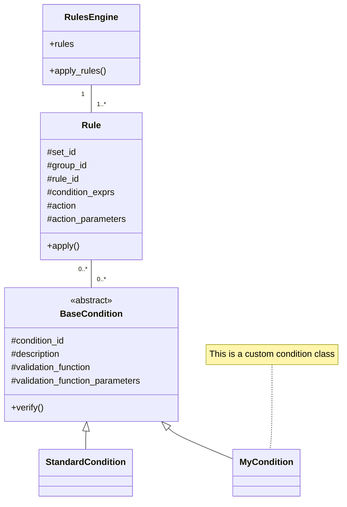

## Simple condition

!!! example "Beta feature"

    **Simple condition** is still a *beta feature*, some cases could not work as designed.

**Simple conditions** are a new and straightforward way of configuring your *conditions*.

It simplifies a lot your rules by:

* Removing the use of a `conditions.py` module (no validation functions needed).
* Removing the `conditions:` configuration key in your YAML files.

!!! note

    With the **simple conditions** you use straight *boolean expressions* directly in your configuration.
    
    It is easyer to read and maintain :+1:

Example :

```yaml hl_lines="6 11 16"
---
rules:
  default_rule_set:
    admission:
      ADM_OK:
        simple_condition: input.power=="strength" or input.power=="fly"
        action: set_admission
        action_parameters:
          value: OK 
      ADM_TO_BE_CHECKED:
        simple_condition: input.age>=150 and input.age!=None
        action: set_admission
        action_parameters:
          value: TO_CHECK     
      ADM_KO:
        simple_condition: null
        action: set_admission
        action_parameters:
          value: KO

actions_source_modules:
  - my_folder.actions  # (1)
```

1. Contains *action function* implementations, no need of the key `conditions_source_modules` here.

How to write a simple condition like:

    input.power=="strength" or input.power=="fly"

* **Left operand (data mapping):** 
    * You must use one of the following prefixes: 
        * `input` (for input data)
        * `output` (for previous rule's result)
    * A *dot path* expression like `input.powers.main_power`.
* **Operator:** you must use basic python *boolean operator* (i.e., `==, <, >, <=, >=, !=`)
* **Right operand:** basic python data types (e.i., `str, int, None`).

!!! warning

    * You can't use: `is` or `in`, as an **operator** (yet).
    * You can't use a `float` as **right operand** (it's a bug, will be fixed).
    * For strings, don't forget the **double quotes** `"`.

!!! danger "Security concern"

    **Python code injection:**

    Because **Arta** is using the `eval()` built-in function to evaluate *simple conditions*:
    
    * **You should never let the user** being able of dynamically define a *simple condition* (in `simple_condition:` conf. key).
    * You should verify that **write permissions on the YAML files** are not allowed when your app is deployed.


## Custom condition

**Custom conditions** are user-defined conditions. 

A **custom condition** will impact the atomic evaluation of each **conditions** (i.e., condition ids).

!!! warning "Vocabulary"

    To be more precise, a **condition expression** is something like:

        CONDITION_1 and CONDITION_2
    
    In that example, the condition expression is made of 2 **conditions** whose **condition ids** are:

    * CONDITION_1
    * CONDITION_2
    
With the built-in condition (also named *standard condition*), **condition ids** map to **validation functions** and **condition parameters** but we can change that with a brand new custom condition.

A custom condition example:

    my_condition: NAME_JOHN and AGE_42

!!! note "Remember"

    *condition ids* have to be in CAPITAL LETTERS.

Imagine you want it to be interpreted as (pseudo-code):

```python
if input.name == "john" and input.age == "42":
    # Do something
    ...
```

With the **custom conditions** it's quite simple to implement.

!!! question "Why using a custom condition?"

    The main goal is to simplify handling of recurrent conditions (e.i., "recurrent" meaning very similar conditions).

### Class implementation

First, create a class inheriting from `BaseCondtion` and implement the `verify()` method as you want/need:

=== "Python >= 3.10"

    ```python
    from typing import Any

    from arta.condition import BaseCondition
    from arta.utils import ParsingErrorStrategy


    class MyCondition(BaseCondition):
        def verify(
            self,
            input_data: dict[str, Any],
            parsing_error_strategy: ParsingErrorStrategy,
        ) -> bool:

            field, value = tuple(self.condition_id.split("_"))

            return input_data[field.lower()] == value.lower()
    ```

=== "Python < 3.10"

    ```python
    from typing import Any, Optional

    from arta.condition import BaseCondition
    from arta.utils import ParsingErrorStrategy


    class MyCondition(BaseCondition):
        def verify(
            self,
            input_data: dict[str, Any],
            parsing_error_strategy: ParsingErrorStrategy,
        ) -> bool:

            field, value = tuple(self.condition_id.split("_"))

            return input_data[field.lower()] == value.lower()
    ```

!!! example "self.condition_id"

    `self.condition_id` will be `NAME_JOHN` for the first condition and `AGE_42` for the second.

!!! info "Good to know"

    The `parsing_error_strategy` can be used by the developer to adapt exception handling behavior. Possible values:

        ParsingErrorStrategy.RAISE
        ParsingErrorStrategy.IGNORE
        ParsingErrorStrategy.DEFAULT_VALUE

### Configuration

Last thing to do is to add your new **custom condition** in the configuration:

```yaml hl_lines="7 29-32"
---
rules:
  default_rule_set:
    check_admission:
      ADMITTED_RULE:
        condition: HAS_SCHOOL_AUTHORIZED_POWER
        my_condition: NAME_JOHN and AGE_42  # (1)
        action: set_admission
        action_parameters:
          value: true
      DEFAULT_RULE:
        condition: null
        action: set_admission
        action_parameters:
          value: false

conditions:
  HAS_SCHOOL_AUTHORIZED_POWER:
    description: "Does applicant have a school authorized power?"
    validation_function: has_authorized_super_power
    condition_parameters:
      power: input.super_power

conditions_source_modules:
  - my_folder.conditions
actions_source_modules: 
  - my_folder.actions

custom_classes_source_modules:
  - dir.to.my_module  # (2)
condition_factory_mapping:
  my_condition: MyCondition # (3)
```

1. Order is important, here it will evaluate `condition` then `my_condition`. Order is arbitrary.
2. List of the modules containing custom classes
3. Mapping between condition keys (`my_condition`) and custom classes (`MyCondition`)

### Class diagram

It is based on the following *strategy pattern*:



!!! info "Good to know"

    The class `StandardCondition` is the built-in implementation of a condition.
